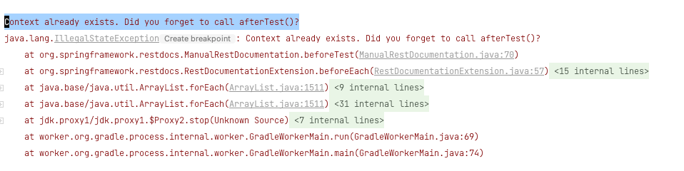
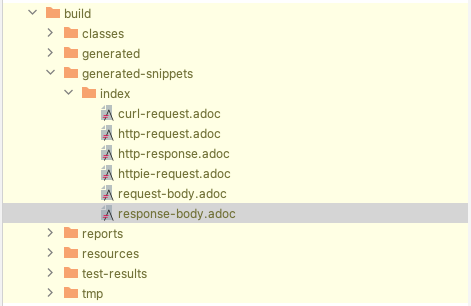

# REST DOCS 사용하기

**The aim of Spring REST Docs is to help you produce accurate and readable documentation for your RESTful services**

스프링 docs는 plain text를 처리해서 html로 만들어주는 작업을 한다.
그리고 마크다운을 사용해서 Spring Rest Docs를 수정가능함

스프링 Rest Docs는 Spring MVC test framework를 통해서 작성됨

To do so, configure your project’s build so that:

1. The documentation is generated before the jar is built
2. The generated documentation is included in the jar

```groovy
bootJar {
    dependsOn asciidoctor //1 
    from("${asciidoctor.outputDir}/html5") { //2 
        into 'static/docs'
    }
}
```

1. Ensure that the documentation has been generated before the jar is built.
2. Copy the generated documentation into the jar’s static/docs directory.

When testing a typical Spring application, you should also apply the SpringExtension:

```groovy
@ExtendWith({ RestDocumentationExtension.class , SpringExtension.class })
class JUnit5ExampleTests {
```

The RestDocumentationExtension is automatically configured with an output directory based on your project’s build tool:

| maven                         | gradle                       |
|-------------------------------|------------------------------|
| **target/generated-snippets** | b**uild/generated-snippets** |

face first Error




정상적으로 생성된 것을 확인할 수 있음.

```java
this.mockMvc.perform(get("/").accept(MediaType.APPLICATION_JSON)) // 1
        .andExpect(status().isOk()) // 2 
        .andDo(document("index")); // 3 
```

1. Invoke the root (/) of the service and indicate that an application/json response is required.
2. Assert that the service produced the expected response.
3. Document the call to the service, writing the snippets into a directory named index (which is located beneath the
   configured output directory). The snippets are written by a RestDocumentationResultHandler. You can obtain an
   instance of this class from the static document method on
   org.springframework.restdocs.mockmvc.MockMvcRestDocumentation.

#

#

#